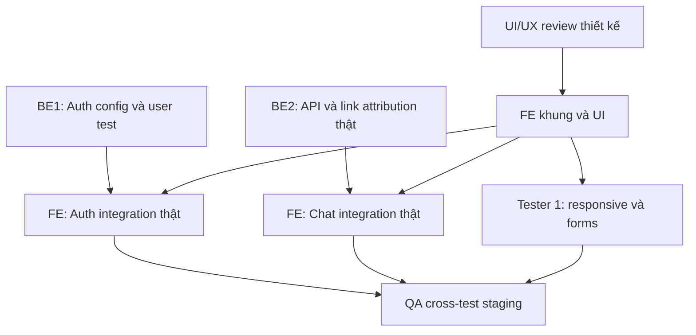

# MY WORK PLAN — FE_W1

## 1. Context
- Project: AI Travel Reseller Network Platform / TravelLink AI (tên giao diện đề xuất).
- Current Week: Tuần 1, 06–09/10/2026.
- My Role: Frontend Developer; thành viên đang yêu cầu thực hiện. Tên dùng khi nộp: cần người dùng xác nhận.
- Current Milestone: Foundation & Data Structure — khung Next.js và UI sơ bộ.
- Deadline: 12:00 ngày 09/10/2026, giờ Việt Nam; cross-test 13:30–17:30 cùng ngày.
- Branch: `Feature_FE_W1_UI_Foundation`, tách từ `dev` tại `d435a55`.
- Last Updated: 08/10/2026.
- Nguồn đã đọc: PRD v1.0; `.ai/process/Roadmap.md`; Kế hoạch Tuần 1; hai ảnh mô tả scope; quy trình Git; `quydinhsinhtask.txt`; `taotask.txt`; `env.text`; rulebook, architecture, contracts và log BE1/BE2 trong repo.

## 2. Executive Summary
Dựng Landing, Login/Register, khung Chatbot, Dashboard Merchant responsive.
Tái sử dụng Auth/API của BE, không tạo DB hoặc pipeline AI mới.
Code UI đã có; cần review thiết kế và cross-test bằng môi trường thật.
Không đánh dấu hoàn thành toàn bộ Auth/E2E khi chưa có cấu hình Supabase thật.
Nộp file này cùng code qua PR vào `dev`; không push/merge trực tiếp `main`.

## 3. TODAY — MUST DO
| Priority | Task | Why | Dependency | Output | Estimated Effort |
|---|---|---|---|---|---|
| P0 | Nhận public Supabase config và tài khoản test | Xác nhận login/logout thật | BE1 | `.env.local` riêng + biên bản test | Chưa chốt; phụ thuộc bàn giao |
| P1 | Review 5 màn hình đã dựng | Chốt bố cục và phạm vi | FE → UI/UX, Tester 1 | Góp ý trên ảnh/code | Chưa chốt |
| P1 | Cross-test Chat bằng tracking link thật | Kiểm tra attribution/API | BE2 + BE1 | Kết quả API/checkout | Chưa chốt |
| P1 | Push nhánh Feature, tạo PR vào dev | Bàn giao có thể review | Quyền GitHub của thành viên | PR + log tiến độ | Sau review code local |

## 4. THIS WEEK — MY TASKS
| ID | Task | Priority | Status | Dependency | Owner | Deliverable | Deadline |
|---|---|---|---|---|---|---|---|
| FE-W1-01 | Khung Next.js App Router, tokens, UI dùng chung | P1 | WAITING_REVIEW | Repo dev; review UI/UX | FE | Layout, CSS, Button/Input, fonts local | 09/10 12:00 |
| FE-W1-02 | Landing Page | P1 | WAITING_REVIEW | FE-W1-01; chốt thiết kế | FE | `/` | 09/10 12:00 |
| FE-W1-03 | Login/Register UI + kết nối Auth hiện có | P1 | BLOCKED | BE1: env/tài khoản/email flow | FE; BE1 review Auth | `/login`, `/register`, validation, pending/error | 09/10 12:00 |
| FE-W1-04 | Khung Chatbot AI và adapter API | P1 | WAITING_REVIEW | BE2 `/api/chat`; link attribution thật cho E2E | FE | `/chat`, demo minh bạch, timeout/error/checkout | 09/10 12:00 |
| FE-W1-05 | Dashboard Merchant + danh sách sản phẩm mẫu | P1 | WAITING_REVIEW | UI/UX; scope merchant | FE | `/merchant`, `/preview/merchant`, lọc/trống/lỗi/tải | 09/10 12:00 |
| FE-W1-06 | Responsive, kiểm tra và bàn giao | P1 | WAITING_HANDOFF | FE01–05; QA staging | FE → Tester 1 | Tests, ảnh chụp, hướng dẫn chạy | 09/10 12:00 |

`WAITING_REVIEW`: code đã dựng, không có nghĩa đã được PM/QA nghiệm thu. FE-W1-03: phần UI đã có, phần E2E thật bị chặn. Không tự ghi DONE cho phần còn thiếu.

## 5. TASK BREAKDOWN
### FE-W1-01 — Foundation
**Goal:** Một khung nhất quán cho 5 màn hình. **Prerequisite:** đọc code và giữ root `app/` hiện có.
- [x] Clone dev, tạo branch Feature; giữ route API/backend.
- [x] TypeScript + Tailwind 4, tokens và font có dấu Việt lưu từ npm.
- [x] UI primitives Button/Input; shared Brand/Header.
- [x] Responsive và skip link/focus-visible/labels.
- [ ] UI/UX review chính thức; registry shadcn kiểm tra lại khi truy cập được.
**DoD:** build/typecheck đạt; UI/UX chấp nhận design system; không trùng thư mục router.
**Handoff:** FE → UI/UX, Tester 1.

### FE-W1-02 — Landing
**Goal:** Giới thiệu Merchant → Reseller → AI → checkout chính thức.
- [x] Hero, lợi ích, quy trình, CTA; dẫn đúng Login/Register/Chat/Dashboard preview.
- [x] Minh họa SVG local, không phụ thuộc ảnh remote.
- [x] Không bịa testimonials, đối tác, số người dùng hoặc thành tích kinh doanh.
- [ ] Review tên thương hiệu đề xuất TravelLink và nội dung.
**DoD:** điều hướng hoạt động; không tràn 320/390/1440px; review thiết kế.
**Handoff:** FE → UI/UX, Tester 1.

### FE-W1-03 — Auth
**Goal:** UI cho Auth hiện có, không viết lại Supabase Auth.
- [x] Email/password, họ tên, vai trò merchant/reseller, xác nhận mật khẩu.
- [x] Hiện/ẩn mật khẩu, validation, pending, lỗi, thông báo kiểm tra email.
- [x] Gọi Server Actions hiện có; validate server và giới hạn redirect nội bộ.
- [x] Hỗ trợ publishable key và fallback anon key theo env.text.
- [x] Thiếu cấu hình: public UI hoạt động, submit bị vô hiệu hóa, portal vẫn chuyển về Login.
- [ ] BE1 cung cấp config, user test; xác nhận sign-up/email confirmation/login/logout thật.
- [ ] BE1 chốt redirect theo role và authorization role. Middleware gốc chỉ kiểm tra có user; Dashboard hiện chỉ là mẫu không truy vấn dữ liệu.
**DoD:** test Auth thật đạt, cookies/session/role được BE1 xác nhận.
**Handoff:** FE → BE1, Tester 1. Không coi role radio phía FE là bảo mật phân quyền.

### FE-W1-04 — Chatbot
**Goal:** Khung trò chuyện rõ ràng, dùng contract BE2.
- [x] Trang chat mở được từ Landing và Dashboard; gửi, Enter/Shift+Enter, reset.
- [x] Không có bộ 3 UUID hợp lệ: demo trả lời cố định và nói rõ chưa gọi AI.
- [x] Có attribution: `POST /api/chat`; gửi message, tối đa 12 tin history và 3 mã URL.
- [x] Loading, timeout 45 giây, error/retry giữ câu hỏi, lịch sử không nhân đôi khi retry.
- [x] Render text an toàn, chỉ hiển thị checkout HTTPS do API trả về; không tự chế URL.
- [ ] Cross-test link thật, RAG, lỗi 404, checkout chính thức với BE2/Tester 2.
**DoD:** UI/contract mock tests đạt và E2E thật được QA xác nhận riêng.
**Handoff:** FE → BE2, Tester 1/2.

### FE-W1-05 — Dashboard
**Goal:** Merchant layout và sản phẩm tĩnh, không giả vờ đã có analytics thật.
- [x] Sidebar, header, KPI mẫu, danh sách sản phẩm cùng nguồn fixture.
- [x] Tìm theo tên, lọc trạng thái, xem chi tiết; giá chưa cung cấp hiển thị đúng.
- [x] Trạng thái có dữ liệu/trống/loading/error và nút thử lại.
- [x] `/preview/merchant` chỉ chứa fixtures công khai; `/merchant` giữ auth gate.
- [ ] UI/UX xác nhận Merchant so với Reseller trong weekly plan.
**DoD:** mock UI có nhãn, chức năng bấm được, responsive; không nhận thay CRUD/analytics thật.
**Handoff:** FE → UI/UX, Tester 1; BE1 cho giai đoạn tích hợp dữ liệu.

### FE-W1-06 — QA & delivery
- [x] Production build và TypeScript.
- [x] ESLint không lỗi; còn 2 warnings cũ ở helper middleware không dùng.
- [x] Kiểm tra HTTP routes public và redirect portal không đăng nhập.
- [x] Bộ Playwright kiểm tra 320/390/1440px, errors, chat/filters/auth UI.
- [x] Ghi hướng dẫn chạy và bộ ảnh minh chứng.
- [ ] QA chạy lại trên Vercel Preview; test real Auth và AI.
- [ ] Push/PR/review/merge được xác nhận từ GitHub.
**DoD:** kết quả QA + PR review, không chỉ build local.

## 6. DEPENDENCY MAP

Code schema/Auth/chat đã có trên base dev; trạng thái môi trường live không suy ra từ việc merge code. UI mock có thể review độc lập; E2E cần env và test data thật.

## 7. BLOCKERS
| Blocker | Tôi cần gì | Người phụ trách | Deadline | Impact |
|---|---|---|---|---|
| env.text chỉ là placeholder | Public URL/key, tài khoản test, cấu hình email | BE1 | Cần trước cross-test 09/10; giờ bàn giao chưa xác nhận | Auth thật chưa test |
| Chưa có Figma được chỉ định cho yêu cầu này | Review 5 màn hình và UI Kit | UI/UX | Trước nghiệm thu; chưa xác nhận giờ | Thiết kế hiện là đề xuất FE |
| Chưa có link attribution/môi trường AI thật | Link với 3 UUID hợp lệ, backend secrets phía server | BE2 + BE1 | Trước cross-test | Mock contract pass không thay E2E |
| shadcn registry bị chặn mạng | Review primitives local hoặc cài registry khi mạng cho phép | FE | Trước chốt UI Kit | Chưa xác nhận cài CLI chuẩn |

## 8. TEAM HANDOFF
| From | To | Deliverable | Format | Deadline | Status |
|---|---|---|---|---|---|
| FE | UI/UX | Tokens, layout, ảnh 5 màn hình | TSX/CSS + PNG | 09/10 12:00 | WAITING_REVIEW |
| FE | BE1 | Auth UI; config fallback; redirect validation | Git diff + docs/fe-w1/README.md | 09/10 12:00 | WAITING_REVIEW |
| FE | BE2 | Chat adapter đúng API contract | TSX + Playwright mocks | 09/10 12:00 | WAITING_HANDOFF |
| FE | Tester 1 | Responsive/Auth UI states | Tests + screenshots | 09/10 12:00 | WAITING_HANDOFF |
| FE | PM/team | FE_W1 + TEAM_WORK_LOG + PR notes | Markdown trong repo | 09/10 12:00 | WAITING_HANDOFF |

## 9. TEAM CONFLICT CHECK
### 🔴 Conflict / NEEDS DECISION
1. **Routing:** Rulebook nói `src/app/`; repo đã dùng `app/` gồm API/Auth. Giữ root app cho implementation này theo thực tế và quyết định BE2 ghi trong log; team cần cập nhật tài liệu.
2. **Dashboard:** Weekly ngày 07/10 nói Reseller; ảnh người dùng/roadmap tuần 1 nói Merchant; người dùng nói dashboard chung. Đã dựng Merchant theo ảnh/roadmap, chưa dựng Reseller hay Admin; cần UI/UX/PM xác nhận.
3. **Git:** Weekly nói merge main/staging; Git workflow yêu cầu Feature → dev, không commit/push trực tiếp main. Nhánh hiện trỏ PR vào dev; release lên main do PM/review.
4. **AI timeline:** Weekly muốn demo chat tuần 1; roadmap đặt Sales Agent tuần 3; PRD launch tuần 4. Deliverable này là UI + adapter/test, không tuyên bố AI Sales production hoàn tất.
5. **PRD vs Roadmap:** PRD mục 8/39 có video generation/Admin Dashboard; roadmap loại khỏi MVP. Không xây các phần chưa được giao; PM cần giải quyết mâu thuẫn scope.
6. **Tên dữ liệu:** Weekly nhắc Tours/Bookings, repo/PRD dùng products/orders. Không tạo schema hoặc endpoint mới.
7. **Env:** env.text dùng ANON_KEY, code gốc dùng PUBLISHABLE_KEY. Adapter hỗ trợ cả hai; public key không được là service-role key.
8. **Log BE1 vs repo:** BE1 log nói env.text đã bỏ tracking, nhưng dev hiện vẫn có file placeholder; không suy ra có credential thật.

### 🟡 Potential Conflict
- UI/UX là owner thiết kế chính thức; FE chỉ đề xuất giao diện triển khai theo yêu cầu hiện tại.
- Tester 1 hỗ trợ test/cắt UI nếu team giao; không tự nhận Tester 1 đang làm hoặc đã hoàn thành.
- Thay đổi Auth/config/middleware chạm vùng BE1: phải review diff trước merge; không sửa schema/RLS/API chat.
- Log BE2 có trạng thái “chờ merge” cũ; base d435a55 hiện đã chứa code chat. Ghi nhận trạng thái code, không ghi đè log người khác.

### 🟢 No Conflict identified trong phạm vi code đã kiểm tra
- Không tạo migration; không làm webhook/n8n/embeddings; không sao chép endpoint chat.
- Mock Dashboard tập trung trong một file; không dùng mock ID gọi API thật.
- Không sửa registry tiến độ BE1_W1/BE2_W1.

## 10. INTERFACE CHECK
| Interface | Tôi | Người liên quan | Cần chốt | Status |
|---|---|---|---|---|
| UI/UX ↔ FE | Implement | UI/UX | Tên thương hiệu, palette, Dashboard actor | WAITING_REVIEW |
| FE ↔ Auth | Forms + Server Action calls | BE1 | Env, email confirmation, role redirect/guard | BLOCKED E2E |
| FE ↔ Chat | message/history/attribution | BE2 | POST /api/chat và checkout URL verified server-side | MOCK VERIFIED; E2E pending |
| FE ↔ DB | Chưa fetch Dashboard | BE1 | Queries/pagination/KPI definitions; không tự bịa API | INTERFACE NOT DEFINED cho dữ liệu Dashboard |
| FE ↔ n8n | Không gọi n8n trực tiếp | BE3 | Không nhận thêm ownership | OUT OF THIS CHANGE |
| FE ↔ QA | Tests & states | Tester 1/2 | Review staging, Auth thật, safe answers | WAITING_HANDOFF |

## 11. OUT OF SCOPE
CRUD sản phẩm thật, analytics thật, Reseller feed, Admin Dashboard, ví/thanh toán nội bộ, booking engine, tự post mạng xã hội, sửa DB/RLS, n8n, AI pipeline, deploy production. Không coi preview UI là phân quyền thật.

## 12. END-OF-DAY UPDATE — 08/10/2026
**DONE (deliverable kỹ thuật local):** 5 màn hình; responsive; adapter Auth/Chat; validation; fixtures; tests; tài liệu.
**IN PROGRESS:** review/bàn giao.
**BLOCKED:** test Auth/AI thật thiếu environment; chưa có review Figma.
**HANDOFF:** tài liệu và code sẵn sàng cho team review; chưa xác nhận người nhận đã nhận.
**NEXT:** nhận env → test Auth/Chat thật → PR dev → QA preview → merge sau review.

## 13. END-OF-WEEK CHECKLIST
- [ ] All assigned tasks completed (Auth E2E còn thiếu)
- [ ] Code committed/pushed — xem kết quả Git trong docs/fe-w1/README.md
- [ ] PR created
- [ ] PR merged vào dev
- [x] Documentation updated
- [ ] Deliverables handed off và người nhận xác nhận
- [ ] QA/Test staging completed
- [ ] No known blocker
- [x] Team status draft updated; không sửa tiến độ người khác

## 14. CÁCH CẬP NHẬT VÀ NỘP
1. Hằng ngày đưa file này cùng thông tin cụ thể: “Tôi đã làm A/B/C; commit/PR là ...; test đạt ...; đang chờ ...”. Chỉ cập nhật hàng bị ảnh hưởng.
2. Cập nhật `.ai/process/Week1/TEAM_WORK_LOG.md`; không đánh dấu DONE nếu chỉ có kế hoạch.
3. Commit code + FE_W1 + log trên nhánh Feature; push branch và mở PR base `dev`.
4. BE1/UI/UX review vùng tương ứng; Tester 1 kiểm tra Vercel Preview; merge sau approve.
5. Cuối tuần giữ file tại `.ai/process/Week1/FE_W1.md`. Nếu team nhận qua Zalo, gửi chính file này kèm link PR; chưa tự gửi tin nhắn thay người dùng.
