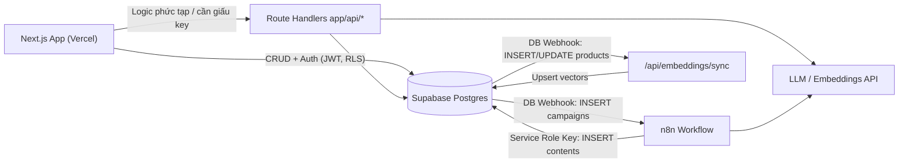

# 🌏 AI Travel Reseller Platform (MVP)

> Nền tảng **phân phối & bán hàng du lịch ứng dụng AI** – kết nối **Merchant** (doanh nghiệp du lịch), **Reseller** (cộng tác viên mạng xã hội) và **Customer** (khách du lịch) thông qua AI tạo nội dung và AI tư vấn bán hàng.
> Thị trường MVP: **Đà Nẵng / Hội An, Việt Nam**.

---

## 📑 Mục lục

1. [Tổng quan dự án](#1-tổng-quan-dự-án)
2. [Công nghệ sử dụng](#2-công-nghệ-sử-dụng)
3. [Kiến trúc & luồng dữ liệu](#3-kiến-trúc--luồng-dữ-liệu)
4. [Cấu trúc thư mục](#4-cấu-trúc-thư-mục)
5. [🚀 Setup dự án sau khi pull về](#5--setup-dự-án-sau-khi-pull-về)
6. [Quy trình làm việc hằng ngày](#6-quy-trình-làm-việc-hằng-ngày)
7. [Làm việc với Database (Supabase)](#7-làm-việc-với-database-supabase)
8. [Quy tắc code bắt buộc](#8-quy-tắc-code-bắt-buộc)
9. [Bản đồ tài liệu (.md)](#9-bản-đồ-tài-liệu-md)
10. [Lộ trình 4 tuần & phân công](#10-lộ-trình-4-tuần--phân-công)
11. [Trạng thái hiện tại & lưu ý quan trọng](#11-trạng-thái-hiện-tại--lưu-ý-quan-trọng)
12. [Xử lý sự cố thường gặp](#12-xử-lý-sự-cố-thường-gặp)

---

## 1. Tổng quan dự án

### 1.1 Bài toán
Doanh nghiệp du lịch thiếu kênh phân phối, chi phí sản xuất nội dung cao, tỷ lệ chuyển đổi thấp và khách hàng thiếu niềm tin khi giao dịch qua mạng xã hội.

### 1.2 Chuỗi giá trị MVP cần chứng minh

```
Merchant (tạo Product/Campaign) → AI Content Factory → Reseller (phân phối)
→ Customer (click/tương tác) → AI Sales Agent → Official Checkout của Merchant → Ghi nhận hoa hồng
```

### 1.3 Phạm vi MVP

| Module | Mô tả |
| :--- | :--- |
| **Merchant Portal** | Quản lý sản phẩm, chiến dịch, hoa hồng |
| **AI Content Factory** | Tự sinh hooks, kịch bản video, caption từ dữ liệu sản phẩm (qua n8n + LLM) |
| **Reseller Portal** | Chọn nội dung, lấy tracking link, xem hoa hồng |
| **AI Sales Agent** | Chatbot RAG tư vấn khách & gửi link thanh toán chính thức |

**❌ Ngoài phạm vi (KHÔNG làm trong MVP):** AI livestream, avatar tự động 24/7, AI video generation, mobile app native, marketplace, ví thanh toán, booking engine phức tạp, Admin UI Dashboard (dùng DB GUI của Supabase thay thế).

### 1.4 Actors

| Actor | Vai trò |
| :--- | :--- |
| **Merchant** | Cung cấp sản phẩm, giá, kho, URL thanh toán chính thức, thiết lập hoa hồng |
| **Reseller** | Đăng nội dung AI tạo lên TikTok/Facebook, nhận hoa hồng |
| **Customer** | Xem nội dung, chat với AI, thanh toán trực tiếp trên trang Merchant |
| **Platform Admin** | Quản lý Merchant/Reseller, duyệt nội dung, theo dõi giao dịch |

### 1.5 Business rules cốt lõi
- 💳 **Thanh toán:** Nền tảng **không giữ tiền**. Mọi thanh toán điều hướng về checkout chính thức của Merchant (`products.payment_url`).
- 🛡️ **AI Safety:** AI chỉ dùng dữ liệu Merchant đã duyệt. **Tuyệt đối không bịa** giá, khuyến mãi, số lượng vé, không giả danh Merchant.
- 📤 **Đăng bài semi-automatic:** Reseller tự tải video/copy caption để đăng. Không auto-post qua API mạng xã hội.
- 🔗 **Attribution:** Ghi nhận hoa hồng qua Tracking link hoặc Unique Voucher Code.

---

## 2. Công nghệ sử dụng

| Lớp | Công nghệ | Phiên bản hiện tại |
| :--- | :--- | :--- |
| Frontend | **Next.js (App Router)**, React, TypeScript | `next 16.3.8`, `react 19.2.8`, `typescript ^5` |
| UI | Tailwind CSS v4, shadcn/ui *(chưa cài)* | `tailwindcss ^4` |
| Backend / DB / Auth | **Supabase** (PostgreSQL 17, Auth, Storage, pgvector) | `@supabase/supabase-js ^2.117`, `@supabase/ssr ^0.12` |
| AI | LLM API (OpenAI/Anthropic), Embeddings `text-embedding-3-small` | — |
| Automation | **n8n** (host riêng) | — |
| Analytics | PostHog | — |
| Deploy | Vercel + Supabase Cloud | — |

> [!WARNING]
> Dự án dùng **Next.js 16** – có nhiều breaking change so với các phiên bản trước (ví dụ `middleware.ts` đã được đổi tên thành **`proxy.ts`**). Trước khi code, hãy đọc tài liệu đi kèm trong `node_modules/next/dist/docs/` (xem [AGENTS.md](AGENTS.md)).

---

## 3. Kiến trúc & luồng dữ liệu



- **Gọi trực tiếp Supabase** (client/server component): CRUD cơ bản & Auth, bảo vệ bằng **RLS**.
- **Gọi qua Route Handlers** (`app/api/...`): tracking link, chat AI Sales Agent, embedding – những việc cần giấu API key.
- **n8n (BE3):** nhận webhook khi có campaign mới → gọi LLM → ghi vào bảng `contents` bằng Service Role Key (chỉ lưu ở env của n8n).
- **RAG (BE2):** product thay đổi → webhook → chunking → embedding → bảng `product_embeddings` (pgvector) → khi chat lấy Top 3 chunk theo cosine similarity.

Chi tiết: [.ai/role/system_architecture.md](.ai/role/system_architecture.md) · API contract: [.ai/role/api_contracts.md](.ai/role/api_contracts.md)

### Các API đã thống nhất (contract)

| Endpoint | Từ → Đến | Mục đích |
| :--- | :--- | :--- |
| `POST /api/tracking-links/generate` | FE → BE1 | Sinh tracking link `reseller_id + campaign_id + product_id` |
| `POST [n8n_webhook_url]` | Supabase → BE3 | Trigger sinh content khi `INSERT` vào `campaigns` |
| `POST /api/chat` | FE → BE2 | Chat AI Sales Agent, trả `reply` + `suggested_checkout_url` |

### Database schema (8 bảng – `public`)

`merchants` · `products` · `resellers` · `social_accounts` · `campaigns` · `contents` · `tracking_events` · `orders`
(Đều đã bật RLS.) Thiết kế gốc: [.ai/role/DATA_SCHEMA.md](.ai/role/DATA_SCHEMA.md) · Migration thực tế: [supabase/migrations/](supabase/migrations/)

---

## 4. Cấu trúc thư mục

```text
ai-travel-reseller/
├── app/                        # Next.js App Router (pages, layouts, route handlers)
│   ├── layout.tsx
│   ├── page.tsx                # Trang chủ (hiện vẫn là template mặc định)
│   └── globals.css
├── src/lib/
│   ├── supabase/
│   │   ├── client.ts           # Supabase client cho Client Component (browser)
│   │   ├── server.ts           # Supabase client cho Server Component / Route Handler
│   │   └── middleware.ts       # Helper refresh session (dùng trong proxy.ts)
│   ├── database.types.ts       # Type DB tự sinh bởi Supabase CLI – KHÔNG sửa tay
│   └── ai-services.ts          # Wrapper gọi LLM/TTS (đang trống)
├── supabase/
│   ├── config.toml             # Cấu hình Supabase local (ports, auth...)
│   └── migrations/             # Các file SQL thay đổi schema
├── public/                     # Static assets
├── .ai/                        # 📚 Tài liệu dự án dành cho team & AI agent
│   ├── process/                # Roadmap, template đánh giá tiến độ
│   ├── role/                   # Rulebook, schema, kiến trúc, API contract, prompts
│   └── skills/                 # Bộ skill cho AI coding agent (Next.js, React, shadcn...)
├── .agents/skills/             # Skill Supabase cho AI agent (quản lý bởi skills-lock.json)
├── AGENTS.md / CLAUDE.md       # Chỉ dẫn cho AI coding agent
└── package.json
```

**Cấu trúc sẽ mở rộng theo RULE_BOOK:**

| Đường dẫn | Mục đích |
| :--- | :--- |
| `app/(auth)/` | Login / Register |
| `app/merchant/[feature]/page.tsx` | Merchant Portal |
| `app/reseller/[feature]/page.tsx` | Reseller Portal |
| `app/admin/[feature]/page.tsx` | Admin |
| `app/api/[feature]/route.ts` | API nội bộ, webhook, gọi LLM |
| `src/components/ui/` | Component shadcn/ui tái sử dụng |
| `src/lib/utils.ts` | Hàm tiện ích chung |
| `supabase/migrations/[timestamp]_[desc].sql` | Thay đổi schema |

> [!NOTE]
> [RULE_BOOK.md](.ai/role/RULE_BOOK.md) ghi `src/app/...`, nhưng code hiện tại đặt App Router ở **`app/`** (root) và thư viện ở `src/lib/`. Team cần thống nhất một chỗ trước khi tạo thêm page. Alias import: `@/*` → `./*` (vd: `import { createClient } from "@/src/lib/supabase/server"`).

---

## 5. 🚀 Setup dự án sau khi pull về

### 5.1 Yêu cầu cài sẵn

| Công cụ | Phiên bản | Ghi chú |
| :--- | :--- | :--- |
| **Node.js** | ≥ 20.9 (khuyến nghị **22 LTS**) | Kiểm tra: `node -v` |
| **npm** | đi kèm Node | Dự án dùng `package-lock.json` → **chỉ dùng npm** |
| **Git** | bất kỳ | |
| **Supabase CLI** | ≥ 2.x | Chạy qua `npx supabase ...` (không cần cài global) |
| Docker Desktop | *(tùy chọn)* | Chỉ cần nếu muốn chạy Supabase **local** |
| Tài khoản Supabase | — | Xin trưởng nhóm/BE1 mời vào project Supabase của team |

### 5.2 Clone & cài dependencies

```bash
git clone https://github.com/NguyenMTue/ai-travel-reseller.git
cd ai-travel-reseller
npm install
```

### 5.3 Tạo file biến môi trường `.env.local`

Tạo file **`.env.local`** ở thư mục gốc (cùng cấp `package.json`) với nội dung:

```env
# Supabase – BẮT BUỘC
NEXT_PUBLIC_SUPABASE_URL=https://<project-ref>.supabase.co
NEXT_PUBLIC_SUPABASE_PUBLISHABLE_KEY=<publishable-key hoặc anon-key>

# Sẽ cần ở các tuần sau (chỉ dùng phía server, KHÔNG có tiền tố NEXT_PUBLIC_)
# SUPABASE_SERVICE_ROLE_KEY=
# OPENAI_API_KEY=
# ANTHROPIC_API_KEY=
# NEXT_PUBLIC_POSTHOG_KEY=
# NEXT_PUBLIC_POSTHOG_HOST=
```

**Lấy key ở đâu?** Vào [Supabase Dashboard](https://supabase.com/dashboard) → chọn project → nút **Connect** (hoặc **Project Settings → API Keys**):
- `Project URL` → `NEXT_PUBLIC_SUPABASE_URL`
- `Publishable key` (dạng `sb_publishable_...`) hoặc `anon public` key → `NEXT_PUBLIC_SUPABASE_PUBLISHABLE_KEY`

> [!IMPORTANT]
> - Code đọc biến **`NEXT_PUBLIC_SUPABASE_PUBLISHABLE_KEY`** (xem [client.ts](src/lib/supabase/client.ts)). Nếu bạn nhận được hướng dẫn cũ ghi `NEXT_PUBLIC_SUPABASE_ANON_KEY` thì hãy **đổi tên** thành `NEXT_PUBLIC_SUPABASE_PUBLISHABLE_KEY`.
> - `.env.local` **đã được ignore** sẵn bởi dòng `.env*` trong `.gitignore`. **Không cần** chạy `echo .env.local >> .gitignore` (trên PowerShell lệnh này còn ghi file sai encoding làm hỏng `.gitignore`).
> - **Không bao giờ** commit key hay để `SUPABASE_SERVICE_ROLE_KEY` có tiền tố `NEXT_PUBLIC_`.
> - Sau khi sửa `.env.local` phải **restart** `npm run dev`.

### 5.4 Kết nối Supabase CLI với project của team (khuyến nghị)

```bash
npx supabase login                               # mở trình duyệt để đăng nhập
npx supabase link --project-ref <project-ref>    # project-ref nằm trong URL: https://<project-ref>.supabase.co
npx supabase migration list                      # kiểm tra migration local/remote đã khớp chưa
```

> Khi `link` sẽ hỏi **database password** – xin BE1/trưởng nhóm.

### 5.5 Chạy dự án

```bash
npm run dev
```

Mở **http://localhost:3000**. Nếu trang hiển thị bình thường và không có lỗi `supabaseUrl is required` trong terminal → setup thành công ✅

### 5.6 (Tùy chọn) Chạy Supabase local bằng Docker

Dùng khi muốn thử migration mà không ảnh hưởng DB chung:

```bash
npx supabase start          # lần đầu sẽ tải Docker images (khá lâu)
npx supabase status         # lấy API URL + publishable/anon key local
npx supabase db reset       # chạy lại toàn bộ migrations (+ seed nếu có) vào DB local
npx supabase stop           # tắt khi xong
```

Sau đó sửa `.env.local` trỏ về local: `NEXT_PUBLIC_SUPABASE_URL=http://127.0.0.1:54321` và key lấy từ `supabase status`. Supabase Studio local: http://127.0.0.1:54323.

### 5.7 Checklist nhanh

- [ ] `node -v` ≥ 20.9
- [ ] `npm install` chạy không lỗi
- [ ] Có file `.env.local` với 2 biến Supabase
- [ ] `npx supabase link` thành công (nếu bạn làm DB/BE)
- [ ] `npm run dev` → mở được http://localhost:3000
- [ ] `npm run lint` không lỗi

---

## 6. Quy trình làm việc hằng ngày

```bash
git checkout main && git pull           # 1. Lấy code mới nhất
npm install                             # 2. Nếu package-lock.json thay đổi
npx supabase migration list             # 3. Nếu có migration mới trong supabase/migrations/
git checkout -b feature/<ten-tinh-nang> # 4. Tạo nhánh làm việc
npm run dev                             # 5. Code & chạy thử
npm run lint && npm run build           # 6. Kiểm tra trước khi push
git push -u origin feature/<ten-tinh-nang>  # 7. Tạo Pull Request vào main
```

### Scripts có sẵn

| Lệnh | Mô tả |
| :--- | :--- |
| `npm run dev` | Chạy dev server (http://localhost:3000) |
| `npm run build` | Build production |
| `npm run start` | Chạy bản build production |
| `npm run lint` | Kiểm tra ESLint |

---

## 7. Làm việc với Database (Supabase)

> [!IMPORTANT]
> **Mọi thay đổi schema phải đi qua file migration** trong `supabase/migrations/`. Không sửa schema trực tiếp trên Dashboard mà không tạo migration tương ứng.

```bash
# Tạo migration mới
npx supabase migration new add_product_embeddings
# → sửa file supabase/migrations/<timestamp>_add_product_embeddings.sql

# Thử trên DB local (nếu dùng Docker)
npx supabase db reset

# Đẩy lên DB chung (chỉ BE1 / người được phân công)
npx supabase db push

# Nếu ai đó đã sửa trên Dashboard → kéo về thành migration
npx supabase db pull

# Sinh lại TypeScript types sau mỗi lần schema thay đổi
npx supabase gen types typescript --linked > src/lib/database.types.ts
```

> [!TIP]
> Trên Windows PowerShell, lệnh `>` có thể ghi file dạng UTF-16. Nếu `database.types.ts` bị lỗi encoding, dùng:
> `npx supabase gen types typescript --linked | Out-File -Encoding utf8 src/lib/database.types.ts`

**Dùng Supabase client trong code:**

```ts
// Client Component
"use client";
import { createClient } from "@/src/lib/supabase/client";
const supabase = createClient();

// Server Component / Route Handler
import { cookies } from "next/headers";
import { createClient } from "@/src/lib/supabase/server";
const supabase = createClient(await cookies());
```

---

## 8. Quy tắc code bắt buộc

Tóm tắt từ [RULE_BOOK.md](.ai/role/RULE_BOOK.md) – **áp dụng cho cả người và AI agent**:

- **Naming:** thư mục `kebab-case` · component `PascalCase` · hàm/biến `camelCase` · bảng DB `snake_case` số nhiều · API luôn là `route.ts`.
- **Dependency:** `page.tsx` → `components/ui`, `lib`, gọi API qua fetch; `route.ts` → `lib/supabase`, `lib/ai-services`; `components/ui` không chứa business logic.
- **API Routes:** luôn kiểm tra Supabase Auth trước khi thay đổi dữ liệu.
- **🚫 Cấm:**
  1. Tự ý đổi cấu trúc thư mục (tạo `Controllers/`, `Models/`, Clean Architecture/C#-style...).
  2. Để AI bịa giá, giờ mở cửa, tồn kho.
  3. Xây ví/thanh toán nội bộ.
  4. Auto-post mạng xã hội.
  5. Hard-code API key / Service Role Key / JWT secret – luôn dùng `process.env.XXX`.
  6. Xóa code đang chạy ngoài phạm vi task.
- **Workflow 6 bước:** Understand → Inspect → Plan → Implement → Validate → Report.
- **Prompts AI** được quản lý phiên bản tại [ai_prompts.md](.ai/role/ai_prompts.md) – sửa prompt phải cập nhật version ở đây.

---

## 9. Bản đồ tài liệu (.md)

| File | Nội dung | Ai cần đọc |
| :--- | :--- | :--- |
| [.ai/process/Roadmap.md](.ai/process/Roadmap.md) | Lộ trình 4 tuần, deliverables, phân công, quy tắc dependency giữa task | **Tất cả** |
| [.ai/role/RULE_BOOK.md](.ai/role/RULE_BOOK.md) | Single Source of Truth: tổng quan, stack, cấu trúc, naming, quy tắc cấm | **Tất cả** |
| [.ai/role/system_architecture.md](.ai/role/system_architecture.md) | Kiến trúc hạ tầng, luồng FE↔Supabase, n8n, RAG/pgvector | Dev, Tester |
| [.ai/role/api_contracts.md](.ai/role/api_contracts.md) | Request/Response của tracking link, webhook n8n, chat API | FE, BE1–3 |
| [.ai/role/DATA_SCHEMA.md](.ai/role/DATA_SCHEMA.md) | Thiết kế 8 bảng dữ liệu | BE1, FE |
| [.ai/role/ai_prompts.md](.ai/role/ai_prompts.md) | System prompt Content Factory & Sales Agent (anti-hallucination) | BE2, BE3, Tester 2 |
| [.ai/process/ai_progress_evaluation_template.md](.ai/process/ai_progress_evaluation_template.md) | Template nhờ AI đánh giá tiến độ team hằng tuần | PM |
| [AGENTS.md](AGENTS.md) / [CLAUDE.md](CLAUDE.md) | Chỉ dẫn cho AI coding agent (Next.js 16 breaking changes) | Người dùng AI agent |
| `.ai/skills/*`, `.agents/skills/*` | Bộ skill cho AI agent (Next.js, React, shadcn, Tailwind, a11y, SEO, Supabase, Postgres) | Người dùng AI agent |

---

## 10. Lộ trình 4 tuần & phân công

**Đội ngũ (9 người):** UI/UX · FE · **BE1** (Supabase/Core DB) · **BE2** (AI Agent/RAG) · **BE3** (n8n/Tracking) · **Tester 1** (hỗ trợ FE 2 tuần đầu) · **Tester 2** (AI Safety) · **Tester 3** (System/Commission).

| Tuần | Trọng tâm | Deliverables chính |
| :--- | :--- | :--- |
| **1** | Foundation & Data | Schema + RLS trên Supabase, Supabase Auth, UI tĩnh Merchant Portal (shadcn), khởi tạo pgvector & n8n |
| **2** | AI Content & Distribution | n8n sinh hooks/scripts/captions khi tạo Campaign, Reseller Feed, API tracking link |
| **3** | Commerce & AI Sales Agent | Tracking click/lead (Supabase/PostHog), Chatbot RAG, logic tính hoa hồng, hallucination test |
| **4** | UAT & Release | Chạy thông E2E, fix 100% bug High/Critical, live trên Vercel + Supabase |

> Quy tắc: task DB của **BE1 là gốc** – không mở task API cho BE2/BE3 khi schema chưa xong; task UI/UX là tiền đề của task FE.

---

## 11. Trạng thái hiện tại & lưu ý quan trọng

**Đã có:**
- ✅ Khung Next.js 16 + Tailwind v4 + TypeScript.
- ✅ Supabase client (browser / server / middleware helper) + `database.types.ts` đã sinh cho 8 bảng.
- ✅ Migration schema ban đầu `20261006162951_remote_schema.sql` (8 bảng, đã bật RLS).

**Chưa có / cần xử lý:**
- ⏳ Chưa có page nghiệp vụ (`app/page.tsx` vẫn là template), chưa cài shadcn/ui, `ai-services.ts` đang trống.
- ⚠️ **Chưa có RLS policy và quyền `SELECT/INSERT/UPDATE/DELETE`** cho role `anon`/`authenticated`/`service_role` trong migration hiện tại → mọi truy vấn qua Supabase client sẽ bị **permission denied / trả về rỗng** cho tới khi BE1 thêm GRANT + policy.
- ⚠️ Chưa có file `proxy.ts` ở root để refresh session Auth (Next.js 16 dùng `proxy.ts` thay cho `middleware.ts`). Helper [middleware.ts](src/lib/supabase/middleware.ts) mới tạo client nhưng chưa gọi `supabase.auth.getUser()`.
- ⚠️ Chưa có `supabase/seed.sql` (config đang trỏ tới) – `db reset` local sẽ không có dữ liệu mẫu.
- ⚠️ `.gitignore` có một dòng `.env.local` bị ghi sai encoding (UTF-16) ở cuối file – nên xóa dòng đó (đã có `.env*` bảo vệ).
- ⚠️ Không commit file ghi chú/secret cá nhân (vd: `env.text`) lên repo.

---

## 12. Xử lý sự cố thường gặp

| Lỗi | Nguyên nhân & cách sửa |
| :--- | :--- |
| `Error: supabaseUrl is required` / `supabaseKey is required` | Thiếu `.env.local` hoặc sai tên biến (phải là `NEXT_PUBLIC_SUPABASE_PUBLISHABLE_KEY`). Sửa xong restart `npm run dev`. |
| `permission denied for table ...` / query trả `[]` | Chưa có GRANT/RLS policy cho bảng – xem mục 11, liên hệ BE1. |
| `npx supabase link` hỏi password rồi lỗi | Sai database password hoặc chưa được mời vào project Supabase. |
| `supabase start` lỗi Docker | Docker Desktop chưa chạy, hoặc trùng port 54321–54324. |
| Lỗi type sau khi đổi schema | Chạy lại lệnh `gen types` ở mục 7. |
| Lỗi lạ khi dùng API Next.js quen thuộc | Next.js 16 có breaking changes – tra `node_modules/next/dist/docs/`. |
| `npm install` lỗi peer deps | Xóa `node_modules` rồi chạy lại `npm install` (không dùng yarn/pnpm để tránh lệch lockfile). |

---

<sub>Repo: https://github.com/NguyenMTue/ai-travel-reseller · Tài liệu nguồn nằm trong thư mục `.ai/`. Khi thay đổi kiến trúc/quy trình, hãy cập nhật README này cùng lúc.</sub>
